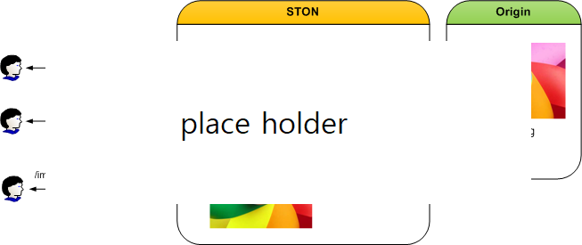

.. _dims_annotation:

DIMS
******************

Annotation
====================================

Annotation은 이미지에 글씨를 입힐 수 있는 기능이다.

사전에 제작된 텍스트 이미지를 "합성" 하는 것이 아니라, 다양한 펜(폰트, 색상, 위치 등)을 이용해 이미지에 텍스트를 타이핑 한다. ::

   # server.xml - <Server><VHostDefault><Options>
   # vhosts.xml - <Vhosts><Vhost><Options>

   <Dims Status="Active" Keyword="dims">
      <Annotation Name="maintext"> ... </Annotation>
      <Annotation Name="subtext"> ... </Annotation> 
      <Annotation Name="watermark"> ... </Annotation>
   </Dims>

각각의 ``<Annotation>`` 은 고유한 ``Name`` 으로 명명된다. 
여러 ``<Annotation>`` 을 미리 등록하고 다음과 같이 ``*`` 를 구분자로 조합하여 사용한다. ::

   // 메인 텍스트
   http:// ... /dims/annotation/maintext

   // 메인 텍스트 + 서브 텍스트
   http:// ... /dims/annotation/maintext*subtext

   // 서브 텍스트 + 워터마크
   http:// ... /dims/annotation/subtext*watermark

   // 메인 텍스트 + 서브 텍스트 + 워터마크
   http:// ... /dims/annotation/maintext*subtext*watermark

기본 텍스트는 ``<Annotation>`` 의 값이며, 약속된 QueryString 또는 요청 헤더를 통해 텍스트를 입력받을 수 있다. ::

   # server.xml - <Server><VHostDefault><Options><Dims>
   # vhosts.xml - <Vhosts><Vhost><Options><Dims>

   <Annotation Name="statictext">STON Edge Server</Annotation>
   <Annotation Name="maintext">$QUERYSTRING[msg]</Annotation>
   <Annotation Name="subtext">$QUERYSTRING[tag]</Annotation>
   <Annotation Name="watermark">powered by $REQ[host]</Annotation>

다음과 같이 텍스트를 전달한다. ::

   // "STON Edge Server" 를 statictext로 삽입
   http:// .../dims/annotation/statictext

   // msg(="HelloWorld") 를 maintext로 삽입
   http:// ...?msg=HelloWorld/dims/annotation/maintext

   // msg(="HelloWorld") 를 maintext로, tag(="Event")를 subtext로 삽입
   http:// ...?msg=HelloWorld&tag=Event/dims/annotation/maintext*subtext

   // tag(="Event")를 subtext로 삽입 (maintext 누락)
   http:// ...?msg=HelloWorld&tag=Event/dims/annotation/subtext

멀티라인을 입력하려면 라인피드(line feed) 문자인 ``\n`` 을 입력한다. ::

   http:// ...?msg=1st\n2nd/dims/annotation/maintext

.. note::

   공백 등 표준 URL escape 문자는 브라우저가 적절히 인코딩하지만 한글의 경우 브라우저마다 처리 방식이 달라 깨질 수 있다. 
   따라서 한글을 입력할 경우 서버에서 한글 인코딩된 결과를 제공해야 한다.  

``<Annotation>`` 은 다양한 속성을 지원한다.

================= ======================== ====================================================
속성              기본 값                   설명
================= ======================== ====================================================
Name              (없음)                     ``<Annotation>`` 이름
Font              none (System Font)        폰트를 지정한다. (ttf, otf, woff 지원)   
FontSize          10                        텍스트 크기
FontColor         #000000                   텍스트 색상
TextAlign         center                    텍스트 정렬 ( ``left`` , ``center`` , ``right``
BackgroundColor   none (투명)                배경 색상
BackgroundWidth   (텍스트 크기에 맞춤)        배경 폭 
BackgroundHeight  (텍스트 크기에 맞춤)        배경 높이
Gravity           c                         텍스트 위치 기준
Geometry          +0+0                      Gravity로부터 거리
Dissolve          50                         텍스트 투명도
================= ======================== ====================================================

- ``FontColor`` 와 ``BackgroundColor`` 는 RGB의 16진수 표현(#FF0000)으로 설정한다. 

- ``BackgroundWidth`` 와 ``BackgroundHeight`` 값이 0이면 텍스트에 맞추어진다. ``Origin`` 을 지정할 경우 대상 이미지의 폭과 넓이를 사용한다.

- ``Gravity`` , ``Geometry`` , ``Dissolve`` 는 <합성>과 동일하다.

상업적으로 재배포가 가능한 폰트만을 기본폰트로 제공한다.

================= ======================================
Font              License
================= ======================================
Roboto            Apache License, Version 2.0
Nanum Gothic      Open Font License
Open Sans         Apache License, Version 2.0
================= ======================================

폰트를 다음 경로에 복사하여 추가가 가능하다. ::

   /usr/local/ston/Fonts

.. note::

   보안적인 이유로 Web Management를 통한 업로드는 지원하지 않는다.

