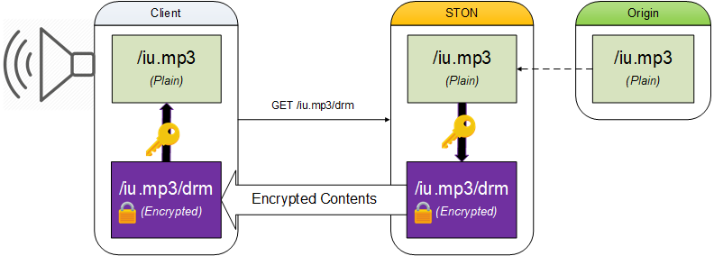

.. _dash:

DRM
******************

콘텐츠를 암호화하여 전송한다. 

::

   # server.xml - <Server><VHostDefault><Options>
   # vhosts.xml - <Vhosts><Vhost><Options>

   <Drm Status="Inactive" Keyword="drm">
      <Algorithm>AES_128_CBC</Algorithm>
      <IV> ... </IV>
      <Token> ... </Token>
      <Key Hash="none">#Token</Token>
   </Drm>

-  ``<Drm>`` DRM 방식을 설정한다. ``Status="Active"`` 로 설정되면 활성화된다. 
   서비스 주소 뒤에 ``Keyword`` 를 suffix로 붙여 DRM을 구동한다. ::

      // URL
      www.example.com/music.mp3

      // DRM 처리된 URL
      www.example.com/music.mp3/drm

-  ``<Algorithm> (기본: AES_128_CBC)`` 
   암호화 알고리즘을 선택한다.
   사용가능한 알고리즘은 다음과 같다.

   ================== ============
   <Algorithm>        Bits
   ================== ============
   AES_128_CBC        128
   AES_256_CBC        256
   RC4_128            128
   RC4                40 ~ 2048
   ================== ============

-  ``<IV>`` Initial Vector.

-  ``<Token>`` 키 생성에 사용될 토큰

-  ``<Key> (기본: #Token)`` 변수를 조합하여 암/복호화에 사용될 키를 생성할 수 있다.
   
   ================== ==================================
   변수                설명
   ================== ==================================
   #token             <Token> 의 값
   #url               클라이언트가 요청한 URL
   #filename1         확장자를 포함한 파일이름
   #filename2         확장자를 제외한 파일이름
   ================== ==================================

   콤마(,)를 구분자로 사용하여 키를 생성한다. 
   
   URL이 /music/iu.mp3 이고 ``<Token>`` 을 ABC로 가정한다면 ``<Key>`` 표현에 따른 암/복호화 키를 다음과 같다.
   
   ========================= ==================================
   <Key Hash="none">         암/복호화 키
   ========================= ==================================
   #token                    ABC
   #url,#token               /music/iu.mp3ABC
   #token,#filename1         ABCiu.mp3
   #filename2,#token,#url    iuABC/music/iu.mp3
   ========================= ==================================

   ``Hash (기본: none)`` 속성이 ``none`` 이라면 위에 조합된 문자열을 암/복호화 키로 사용한다.

   ``Hash`` 속성을 지정하면 아래와 같이 조합된 문자열을 해쉬한 값을 키로 사용한다. ::

      Hash( <Key> ... </Key> )

   ``Hash`` 속성은 ``none`` , ``MD5`` , ``SHA-1`` , ``SHA-256`` 를 지원한다.
   
    
``<IV>`` 와 ``<Token>`` 를 평문(Plain Text)으로 제공하면 보안적으로 취약하다.
이를 아래 API를 이용해 암호화한 뒤 설정할 것을 권장한다. ::

   /command/encryptpassword?plain=abcdefghijklmnop

암호화된 ``<IV>`` , ``<Token>`` 설정을 위해 ``Type="enc"`` 속성을 추가한다. ::

   # server.xml - <Server><VHostDefault><Options>
   # vhosts.xml - <Vhosts><Vhost><Options>

   <Drm Status="Active" Keyword="drm">
      <Algorithm>AES_128_CBC</Algorithm>
      <IV Type="enc">RokyekMd0IjDnRGKjVE7sQ==</IV>
      <Token Type="enc">x4KHA1b+AirBOIoaeEBHmg==</Token>
      <Key>#Token</Key>
   </Drm>

.. note::

   암호화 API는 인증서에 기반하여 동작한다. 
   따라서 인증서가 다르면 암/복호화 결과가 다르다.

