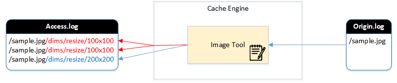

.. _imagelog:

Image Log
******************

On-the-fly 이미지 처리 결과를 로깅한다.

Image.log는 Access.log와 Origin.log사이에 위치하며 다음과 같은 관계를 가진다.

-  ``Access.log`` 신규 가공일 경우(TCP_MISS)에만 Image.log에 기록된다.
-  ``Origin.log`` Image.log에만 기록되었다면 원본 이미지는 이미 캐싱되어 있는 상태이다.

설정
====================================

기존 로그 설정방식과 동일하며, Access.log, Origin.log와 동일하게 가상호스트별로 설정한다. ::

   # server.xml - <Server><VHostDefault><Log>
   # vhosts.xml - <Vhosts><Vhost><Log>

   <Image Type="time" Unit="1440" Retention="10">OFF</Image>

기본 값은 ``OFF`` 이다.

로그 형식
====================================

성공여부와 상관없이 모두 기록된다. ::

    #Fields: date time cs-sid cs-uri x-result x-error x-origin-size x-processed-size time-taken time-processed
    2019-01-24 14:59:18 11 /hideface/10.jpg/dims/format/ 500 format 248838 0 139 79
    2019-01-24 14:59:35 34 /hideface/10.jpg/dims/format/webp/resize/x 500 resize 248838 0 90 85
    2019-01-24 14:59:55 21 /hideface/10.jpg/dims/resize/x/format/webp/ 500 resize 248838 0 29 25
    2019-01-24 15:00:05 49 /hideface/10.jpg/dims/resize/100x123/format/webp/ 200 - 248838 15618 92 86
    2019-01-24 15:00:36 12 /img/transfersmallfile.php/dims/resize/100x123/format/webp/ 400 404 1162 0 26 0
    2019-01-24 15:02:24 15 /10.jpg/dims/resize/100x100 401 11326337 11326337 0 757 0

모든 필드는 공백으로 구분되며 각 필드의 의미는 다음과 같다.

-  ``date`` 이미지 가공이 완료된 날짜
-  ``time`` 이미지 가공이 완료된 날짜
-  ``cs-sid`` 이미지 가공을 요청한 클라이언트 세션 ID
-  ``cs-uri`` 클라이언트가 요청한 URI
-  ``x-result`` 이미지 가공 결과코드

   - ``200`` 성공
   - ``304`` 변환된 이미지의 TTL이 연장되었다. (= 원본 이미지가 변경되지 않았다.)
   - ``400`` 원본 이미지의 응답코드가 200이 아니다. ( ``x-error`` : 원본 HTTP 응답코드)
   - ``401`` 원본 이미지 크기가 유효 범위가 아니다. ( ``x-error`` : 원본 Content-Length)
   - ``402`` 원본 이미지가 100% 로딩되지 못했다.
   - ``500`` 이미지 가공 중 에러가 발생했다. ( ``x-error`` : 실패 사유)
   - ``501`` 이미지 가공은 완료되었으나 저장과정 중 에러가 발생하였다.

-  ``x-error`` 이미지 가공 에러 상세내용
-  ``x-origin-size (단위: Bytes)`` 원본 이미지 크기
-  ``x-processed-size (단위: Bytes)`` 가공된  크기
-  ``time-taken (단위: 밀리세컨드)`` 이미지 가공 HTTP 트랜잭션이 완료될 때까지의 전체 소요시간
-  ``time-processed (단위: 밀리세컨드)`` 이미지 가공 소요시간