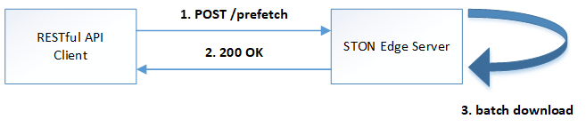
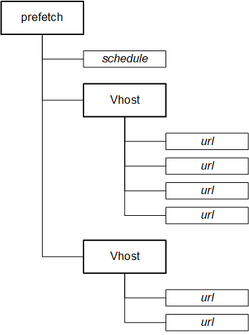
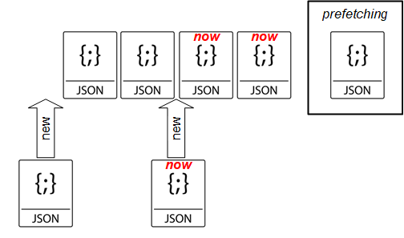

.. _prefetch:

Prefetch
******************

API를 이용해 콘텐츠를 미리 캐싱한다.

Prefetch는 관리자가 Manager port를 통해 Prefetch 파일 목록 업로드 하는 것으로 동작한다. 
업로드 된 파일목록은 설정된 시간(즉시 또는 예약시점)에 순차적으로 다운로드 된다.

API 상세
====================================

관리자는 다음 주소로 파일목록을 POST 메소드로 업로드 한다. ::

   http://{STON-IP}:{ManagerPort}/prefetch

업로드 파일 구조는 가상호스트 별로 URL 목록이 나열된 구조이다.

아래는 샘플 파일목록이다. ::

    {
        "prefetch" : {
            "schedule" : "now",
            "vhosts" : [
                {
                    "vhost" : "foo.com",
                    "urls" : [
                        { "url" : "/log.zip" },
                        { "url" : "/sample/data" },
                        { "url" : "/product/catalog/beauty.pdf?code=1203" }
                    ]
                },
                {
                    "vhost" : "bar.com",
                    "urls" : [
                        { "url" : "/demo.zip", "auth-code": "1323901283" },
                        { "url" : "/search/topN.list", "keyword": "shoe" }
                    ]
                }
            ]
        }
    }

규칙은 다음과 같다.

-  ``url`` 은 가상호스트 하위에 위치하며 반드시 "/" 로 시작해야 한다.
-  ``url`` 의 대소문자 구분은 가상호스트 설정을 따른다.
-  가상호스트가 `Accept-Encoding헤더 <https://ston.readthedocs.io/ko/latest/admin/caching_policy.html#accept-encoding>`_ 를 구분하도록 설정되었다면 다운로드는 ON/OFF 를 구분하여 2번 이루어진다.
-  접수된 파일목록은 예정된 시간에 수행되지만 ``schedule`` 속성이 ``now`` 인 경우 (현재 작업 중인 prefetch가 없다면) 즉시 시작된다.
-  (bar.com의 예와 같이) 만약 가상호스트에 별도의 커스터마이징 모듈이 연동되어 있다면 예제의 ``auth-code`` 나 ``keyword`` 처럼 커스텀 필드로 확장 가능하다.

POST 지원
====================================

prefetch는 GET 메소드를 기본으로 한다. 
POST 메소드 원본서버와 통신해야 할 경우 다음과 같이 ``method`` , ``post-body`` 필드를 확장한다. ::

    {
        "prefetch" : {
            "schedule" : "now",
            "vhosts" : [
                {
                    "vhost" : "foo.com",
                    "urls" : [
                        { 
                            "url" : "/log.zip",
                            "method" : "post",
                            "post-body" : "home=Cosby&favorite+flavor=flies"
                        },
                        {
                            "url" : "/sample/data", 
                            "method" : "post",
                            "post-body" : "--boundary\nContent-Disposition: form-data; name=\"field1\""
                        }
                    ]
                }
            ]
        }
    }

-  ``method`` POST 다운로드의 경우 항상 ``post`` 이다.
-  ``post-body`` POST 메소드로 원본서버에 보낼 Body 데이터.

스케쥴링
====================================

파일을 원하는 시점에 미리 캐싱 해두면 서비스 품질 향상과 원본 부하분산 효과를 동시에 얻을 수 있다. 

스케쥴링에는 3가지 방식이 제공된다.

1. Prefetch 시간을 고정한다. ``schedule`` 속성을 생략한다. ::

      # server.xml - <Server>

      <Cache>
        <Prefetch>
          <Time>04:00</Time>
          <Concurrent>5</Concurrent>
          <Log Type="size" Unit="5" Retention="5" SysLog="OFF" Compression="OFF">ON</Log>
        </Prefetch>
      </Cache>

   -  ``<Time> (기본: AM 4)`` 등록된 prefetch 를 수행할 시간을 설정한다. 오후 11시 10분을 설정하고 싶다면 23:10으로 설정한다.
   -  ``<Concurrent> (기본: 5)`` 동시에 다운로드를 진행할 세션 수를 설정한다.
   -  ``<Log>`` Prefetch 상세로그를 구성한다.

2. 즉시 Prefetch를 수행한다. 
   ``schedule`` 속성을 ``now`` 로 지정한다. ::

        {
            "prefetch" : {
                "schedule" : "now",
                "vhosts" : [ ... (생략) ... ]
            }
        }

3. Prefetch 시간을 예약한다.
   ``schedule`` 속성을 ``reserved`` 로 지정하고 ``reservation-time`` 을 반드시 ISO-8601 규격으로 명시한다. ::

        {
            "prefetch" : {
                "schedule" : "reserved",
                "reservation-time" : "2019-11-19T09:00:00Z",
                "vhosts" : [ ... (생략) ... ]
            }
        }

수행정책은 다음과 같다.

-  Prefetch 스케쥴러의 기본 동작은 FIFO(First Input First Out) 이다.
-  현재 진행 중인 Prefetch 목록은 간섭받지 않는다.
-  ``schedule`` 이 ``now`` 인 목록이 그렇지 않은 목록보다 항상 우선한다. ``now``목록끼리는 FIFO 로 수행된다.
-  ``schedule`` 이 ``reserved`` 인 목록의 시간이 같을 경우 FIFO 로 수행된다.
-  ``schedule`` 이 ``reserved`` 인 목록이 경쟁에서 밀려 수행시간이 지나면 다른 ``reserved`` 보다 우선 수행된다.

로그
====================================

Prefetch 로그는 2가지로 구분된다. 

먼저 Prefetch 목록의 접수와 실행은 info.log에 기록된다. ::

    2019-07-10 14:48:51 [INFO] [PREFETCH] Register task. (Task: /usr/loca/ston/prefetch/20190710_144851_0.scheduled)
    2019-07-10 14:48:58 [INFO] [PREFETCH] Register task. (Task: /usr/loca/ston/prefetch/20190710_144858_1.scheduled)
    2019-07-10 14:49:04 [INFO] [PREFETCH] Register task. (Task: /usr/loca/ston/prefetch/20190710_144904_2.scheduled)
    2019-07-10 14:49:09 [INFO] [PREFETCH] Register task. (Task: /usr/loca/ston/prefetch/20190710_144909_3.scheduled)

    ... (중략) ...

    2019-07-11 02:00:00 [INFO] [PREFETCH] Start task. (Task: /usr/loca/ston/prefetch/20190710_144851_0.scheduled)
    2019-07-11 02:02:05 [INFO] [PREFETCH] Complete task. (Task: /usr/loca/ston/prefetch/20190710_144851_0.scheduled)
    2019-07-11 02:02:05 [INFO] [PREFETCH] Start task. (Task: /usr/loca/ston/prefetch/20190710_144858_1.scheduled)
    2019-07-11 02:30:47 [INFO] [PREFETCH] Complete task. (Task: /usr/loca/ston/prefetch/20190710_144858_1.scheduled)
    2019-07-11 02:30:47 [INFO] [PREFETCH] Start task. (Task: /usr/loca/ston/prefetch/20190710_144904_2.scheduled)
    2019-07-11 03:11:17 [INFO] [PREFETCH] Complete task. (Task: /usr/loca/ston/prefetch/20190710_144904_2.scheduled)
    2019-07-11 03:11:17 [INFO] [PREFETCH] Start task. (Task: /usr/loca/ston/prefetch/20190710_144909_3.scheduled)
    2019-07-11 04:05:04 [INFO] [PREFETCH] Complete task. (Task: /usr/loca/ston/prefetch/20190710_144909_3.scheduled)

위 로그 파일에서 알 수 있듯이 업로드된 형태 그대로 prefetch 디렉토리에 기록된다.  
등록된 목록은 예약시점인 오전 2시부터 순차적으로 진행됨을 알 수 있다.

Prefetch를 수행하는 Prefetcher는 Loopback(127.0.0.1) 클라이언트이다.
따라서 Prefetcher가 STON을 원본서버로 바라보는 형태의 `Origin 로그 <https://ston.readthedocs.io/ko/latest/admin/log.html#origin>`_ 형식으로 기록된다. ::

    #date time cs-sid cs-tcount c-ip cs-method s-domain cs-uri s-ip sc-status cs-range sc-sock-error sc-http-error sc-content-length cs-requestsize sc-responsesize sc-bytes time-taken time-dns time-connect time-firstbyte time-complete cs-reqinfo cs-acceptencoding sc-cachecontrol s-port x-vhostname x-task
    2019-07-11 02:00:56 7 1 127.0.0.1 GET 127.0.0.1 /hideface/test1.jpg?8 127.0.0.1 200 - - - 1647094 93 323 1647094 280 0 1 168 112 http - - 80 - 0 foo.com 20190710_155655_1.now
    2019-07-11 02:00:56 9 1 127.0.0.1 GET 127.0.0.1 /hideface/test1.jpg?8 127.0.0.1 200 - - - 1647094 125 323 1647094 93 0 1 11 82 http gzip+deflate - 80 - 0 foo.com 20190710_155655_1.now
    2019-07-11 02:00:56 10 1 127.0.0.1 GET 127.0.0.1 /hideface/test1.gif?8 127.0.0.1 200 - - - 2021918 93 322 2021918 103 0 2 10 93 http - - 80 - 0 foo.com 20190710_155655_1.now
    2019-07-11 02:00:56 11 1 127.0.0.1 GET 127.0.0.1 /hideface/test1.gif?8 127.0.0.1 200 - - - 2021918 125 322 2021918 103 0 1 10 93 http gzip+deflate - 80 - 0 foo.com 20190710_155655_1.now
    2019-07-11 02:00:59 12 1 127.0.0.1 GET 127.0.0.1 /hideface/test1.mp4?8 127.0.0.1 200 - - - 50029902 93 324 50029902 2443 0 1 22 2421 http - - 80 - 0 foo.com 20190710_155655_1.now

모든 필드는 `Origin 로그 <https://ston.readthedocs.io/ko/latest/admin/log.html#origin>`_ 형식과 유사하며 다음 확장필드를 가진다.

-  ``x-vhostname`` 가상호스트명
-  ``x-task`` prefetch 파일명

.. note::

   Prefetch 다운로드는 `Access 로그 <https://ston.readthedocs.io/ko/latest/admin/log.html#access>`_ 에 기록되지 않는다. 
   만약 기록된다면 클라이언트 접근과 구분이 어려울 뿐만 아니라 통계/수치해석등을 위한 로그 분석 시 왜곡된 결과를 초래할 수 있다. 
   `Origin 로그 <https://ston.readthedocs.io/ko/latest/admin/log.html#origin>`_ 에는 정상적으로 기록된다.
