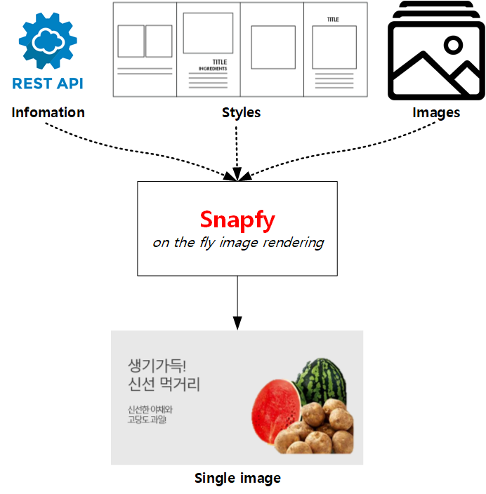
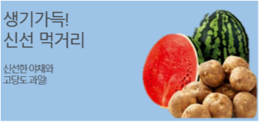

.. _snapfy:

Snapfy
******************

Snapfy/스냅파이는 정보(API), 스타일, 이미지를 on-the-fly로 결합하는 이미지 엔진이다. 

주요 특징은 다음과 같다.

  - 다양한 이미지 표현과 재사용
  - Micro-service/API에 최적화된 동작방식
  - In/Out 되는 모든 리소스에 대한 캐싱 지원
  - 이미지툴과 연계를 통한 선/후 가공 지원

.. note::

   Snapfy엔진에 의해 생성된 이미지를 Snapfied Image라고 부른다. 
   Snapfied Image 생성에 필요한 정보, Source-Image등은 Component라고 지칭한다.

Snapfy 구성에는 Composite과 Style이 필요하다.

-  **Composite**
   
   컴포넌트(텍스트, 이미지)에 대한 정의와 이를 어떤 Style로 렌더링할 것인지 정의하는 JSON. 

-  **Style**
   
   각 컴포넌트를 어떻게 이미지화할 것인지 정의하는 JSON.

.. _snapfy-flow:

동작 시나리오
====================================

3가지 동작 시나리오를 가진다.

1. ``Endpoint`` 주소를 GET 방식으로 요청한다. 백엔드로부터 Composite과 Style을 다운로드 받는다. Style은 멀티로 구성이 가능하다.
   
   .. figure:: img/snapfy4.png
      :align: center

2. ``Endpoint`` 주소로 Composite을 POST 방식으로 업로드한다. 백엔드로부터 Style을 다운로드 받는다. Style은 멀티로 구성이 가능하다.
   
   .. figure:: img/snapfy5.png
      :align: center

3. ``Endpoint`` 주소로 Composite과 Style을 POST 방식으로 업로드한다. 백엔드와 통신하지 않는다.

   .. figure:: img/snapfy6.png
      :align: center

.. _snapfy-composite:

Composite
====================================

Composite은 가장 핵심이 되는 구성요소로 "무엇을 어떤 방식으로 그릴 것인가?" 를 JSON 형식으로 정의한다. ::

   {
      "#style" : "https://example.com/snapfy/styles/simple",
      "#body" : "body",
      "img-company-ci" : "http://www.winesoft.co.kr/assets/img/winesoft.png",
      "txt-main" : "생기가득\n신선 먹거리",
      "txt-sub" : "신선한 야채와\n고당도 과일!"
   }

다음과 같이 간단히 ``#body`` 만 변경하여 배경 색과 크기가 다른 이미지를 만들 수 있다. 

::

   {
      "#style" : "https://example.com/snapfy/styles/simple",
      "#body" : "body-blue",
      ... (생략) ...
   }

또는 ``#style`` 을 변경하여 완전히 다른 형태의 이미지를 즉시 만들 수 있다.

::

   {
      "#style" : "https://example.com/snapfy/styles/portrait",
      ... (생략) ...
   }

.. _snapfy-composite-component:

컴포넌트
------------------------------------

컴포넌트는 텍스트와 이미지를 지칭하며, JSON KVP(Key-Value Pair) 로 표현한다. ::

   {
      ... (생략) ...
      "img-company-ci" : "http://www.winesoft.co.kr/assets/img/winesoft.png",
      "txt-main" : "스냅파이\n SNAPFY ",
      "txt-sub" : "반갑습니다."
   }

``img-company-ci`` , ``txt-main`` , ``txt-sub`` 가 컴포넌트 <Key> 다. 규칙은 다음과 같다.

-  <Key/Value> 모두 문자열(string)이다.
-  텍스트는 반드시 ``txt-`` 로 시작해야 한다.
-  이미지는 반드시 ``img-`` 로 시작해야 한다.

엔진은 <Value>를 <Key> 방식으로 렌더링한다. 
<Key>는 반드시 ``#style`` 에서 참조할 수 있어야 한다. 
만약 찾을 수 없다면 무시된다.

.. note::

   컴포넌트가 없는 Composite도 가능하다. 
   화면에 그려질 컴포넌트가 없어도 배경만으로 이미지 생성이 가능하기 때문이다.

.. _snapfy-composite-style:

스타일 선택
------------------------------------

이미지 생성에 필요한 요소는 모두 ``#style`` 에 정의된다. 
따라서 ``#style`` 을 다운로드 받지 못한다면 이미지는 생성할 수 없다.

``#style`` 은 3가지 형식으로 표현이 가능하다.

-  **1. 단일 URL**
   
   앞서 보았듯이 문자열 Key-Value로 정의하는 방식이다. ::

      {
         "#style" : "https://example.com/snapfy/styles/simple",
         ... (생략) ...
      }

   가장 단순하며 기본이 되는 방식이다.

-  **2. 멀티 URL**

   목적에 맞게 나뉘어진 스타일을 배열로 조합하는 방식이다. 먼저 선언한 순서대로 적용된다. ::

      // 세로 배경 + 크고 굵은 폰트 조합
      {
         "#style" : [
            "https://example.com/snapfy/styles/body-portrait",
            "https://example.com/snapfy/styles/font-big-bold",
            "https://example.com/snapfy/styles/simple"
         ],
         ... (생략) ...
      }

      // 세로 배경 + RED 계통의 폰트 조합 
      {
         "#style" : [
            "https://example.com/snapfy/styles/body-portrait",
            "https://example.com/snapfy/styles/palette-red",
            "https://example.com/snapfy/styles/simple"
         ],
         ... (생략) ...
      }

   매번 전체 스타일을 생성하지 않고도 조합만으로 다양한 스타일을 생성할 수 있어 높은 확장성을 가진다.

-  **3. 인라인**

   스타일을 직접 정의한다. ::

      {
         "#style" : {
            "body" : { ... } ,
            "txt-main" : { ... } ,
            "txt-sub" : { ... } ,
            "img-company-ci" : { ... } 
         }
      }

   백엔드 종속성 없이 동작이 가능한 단순함을 제공한다.

Style
====================================

아래 차이점을 제외하면 `CSS(Cascading Style Sheet) <https://www.w3schools.com/css/default.asp>`_ 와 동일하다.

-  JSON 형식이다.
-  Cascading되지 않는다.

::

    {
        "body" : {
            "background-color": "#4CCAD4",
            "width" : "480px",
            "height" : "320px"
        },

        "body-backwall" : {
            "background-image": "url(`http://background.com/paper.jpg`)";
            "width" : "1024px",
            "height" : "400px"
        },

        "txt-main" : {
            "font-family": "맑은고딕",
            "font-size": "20px",
            "color" : "white",
            "left" : "30px",
            "top" : "30px"
        },

        "txt-main-big-bold" : {
            "font-family": "맑은고딕",
            "font-size": "30px",
            "font-weight": "bold",
            "color" : "white",
            "left" : "30px",
            "top" : "30px"
        },

        "txt-sub" : {
            "font-family": "맑은고딕",
            "font-size": "12px",
            "color" : "white",
            "left" : "30px",
            "top" : "100px"
        },

        "img-company-ci" : {
            "left": "195px",
            "top" : "25px"
        }
    }

각 컴포넌트-스타일(컴포넌트를 그리기 위해 정의한 스타일)은 1차원 JSON 형식으로 표현되며 `CSS <https://www.w3schools.com/css/default.asp>`_ 와 동일한 <Key/Value>를 가진다. 

.. _snapfy-composite-style-output:

이미지 속성
------------------------------------

``body`` 속성으로 출력되는 이미지를 동적으로 변경한다.

=========== ========================================
속성         설명
=========== ========================================
width       이미지 가로 크기 (단위: 픽셀)
height      이미지 세로 크기 (단위: 픽셀)
format      이미지 포맷 (png 또는 jpg)
quality     이미지 포맷이 jpg인 경우 품질 (0~100)
=========== ========================================

동적으로 출력 이미지 형태를 다음과 같이 조절한다.

::

    {
        # jpg 이미지 출력
        "body-jpg" : {
            "background-color": "#4CCAD4",
            "format" : "jpg"
        },

        # 품질 60% jpg 이미지 출력
        "body-jpg-low" : {
            "background-color": "#4CCAD4",
            "format" : "jpg",
            "quality" : 60
        },

        # png 이미지 출력
        "body-png" : {
            "background-color": "#4CCAD4",
            "format" : "png"
        }
    }

속성이 존재하지 않을 경우 기본설정을 사용한다. (운영 참조)

.. _snapfy-composite-style-select:

이미지 선택
------------------------------------

앞서 본 것과 같이 멀티 이미지 구성이 가능하다.
Style의 ``#body`` 속성을 이 중 하나를 선택한다.

기본 값은 ``body`` 이다. 따라서 아래 2표현은 동일하다. ::

   {
      "#style" : "https://example.com/snapfy/styles/simple",
      "#body" : "body"
   }

   {
      "#style" : "https://example.com/snapfy/styles/simple"
   }

``#body`` 태그가 별도로 존재하는 이유는 ``#style`` 에 여러 body 구성(이미지 크기 및 배경)을 해 놓고 선택적으로 사용하기 위함이다. ::

   # 같은 #style 주소를 참조한다.
   # 검은 배경
   {
      "#style" : "https://example.com/snapfy/styles/simple",
      "#body" : "body-jpg"
   }

   # 와이드 배경
   {
      "#style" : "https://example.com/snapfy/styles/simple",
      "#body" : "body-png"
   }

   # 이미지 배경
   {
      "#style" : "https://example.com/snapfy/styles/simple",
      "#body" : "body-backwall"
   }

이미지툴 연동
====================================

이미지툴은 2개의 시점에서 연동이 가능하다. 

-  Snapfied-image 후가공
-  컴포넌트 이미지 선가공

후가공은 Snapfy 엔진에서 생성된 이미지를 이미지툴이 가공하는 것을 의미한다. ::

   http://img.example.com/snapfy/nike

만약 주소가 위 URL로 노출되었다면 해당 이미지를 소스로 하여 아래와 같이 이미지툴을 연동할 수 있다. ::

   http://img.example.com/snapfy/nike/image-tool/resize/100x100/format/webp

또한 아래와 같이 스타일을 정의할 때 ``img-`` 에 이미지툴 속성으로 효과를 먼저 적용할 수 있다. ::

   "img-company-ci" : {
        "left": "195px",
        "top" : "25px",
        "image-tool" : "/dims/round/100"
   }

   "img-company-ci-grayround" : {
        "left": "195px",
        "top" : "25px",
        "image-tool" : "/dims/grayscale/true/round/100"
   }

운영 (미완성)
====================================

예제 ::

   // 사용자 노출 URL
   http://img.example.com/snapfy/nike

   // Snapfy가 캐싱할 Composite URL 주소
   http://api.example.com/snapfy/composite?id=nike

노출 및 composite URL은 정규표현식을 통해 어떠한 표현도 가능하다.  

개발용 설정 ::

   <?xml version="1.0" encoding="UTF-8"?>
   <Vhosts>
      <Vhost Name="snapfy.com" Status="Active">
         <Origin ByClient="OFF">
            <Address>127.0.0.1:808</Address>
         </Origin>
         
         <Options>
            <BypassPostRequest>OFF</BypassPostRequest>
            <PostRequest MaxContentLength="1024000" BodySensitive="ON">ON</PostRequest>
            <Dims Status="Active" Keyword="dims" />
         </Options>
         
         <Snapfy Status="Active">
            <Endpoints>
                  <Endpoint>
                     <Pattern>/snapfy/(.*)</Pattern>
                     <Composite>/sb/composite/#1</Composite>
                  </Endpoint>
            </Endpoints>
            <Cache>
               
               <Image>ON</Image>
            </Cache>
            <Output>
               <Width>640</Width>
               <Height>480</Height>
               <Format>png</Format>
               <Quality>85</Quality>
            </Output>
         </Snapfy>    
      </Vhost>

      <Vhost Name="style.com" Status="Active">
         <Origin ByClient="OFF">
            <Address>127.0.0.1:808</Address>
         </Origin>
      </Vhost>

      <Vhost Name="image.com" Status="Active">
         <Origin>
            <Address>image.com</Address>
         </Origin>
         <Dims Status="Active" Keyword="dims" />
      </Vhost>
   </Vhosts>

Snapfy는 다음 2조건을 만족해야 동작한다.

-  ``<Snapfy>`` 설정의 ``Status`` 속성이 ``Active`` 인 경우
-  클라이언트가 요청한 URL이 ``<Endpoint>`` 의 ``<Pattern>`` 과 매칭되는 경우

이상의 조건이 아니라면 일반 캐싱으로 동작한다. 기타 세부 설정은 다음과 같다.

-  ``<Endpoints>`` 하위에 멀티 ``<Endpoint>`` 를 통해 엔드유저에게 노출할 주소를 설정한다. 정규표현식을 사용한다.

   - ``<Pattern>`` 엔드유저가 호출하게 될 Snapfy-URL 패턴
   - ``<Composite>`` (GET 방식일 경우) 패턴에 해당하는 Composite 주소 패턴

-  ``<Cache>`` 이미지 생성에 필요한 리소스(Style, Image 등)를 캐싱한다. 
   캐싱을 위해서는 참조되는 URL의 도메인명과 동일한 가상호스트가 설정되어 있어야 한다.

   - ``<Style> (기본: ON)`` Style API 호출 결과를 캐싱한다.
   - ``<Image> (기본: ON)`` 참조하는 이미지 파일을 캐싱한다.

-  ``<Output>`` Snapfied-Image 기본 설정

   -  ``<Width> (기본: 640, 단위: 픽셀)`` 기본 가로 크기
   -  ``<Height> (기본: 480, 단위: 픽셀)`` 기본 세로 크기
   -  ``<Format> (기본: png)`` 기본 이미지 포맷 ( ``png`` 또는 ``jpg`` )
   -  ``<Quality> (기본: 85, 범위: 0~100)`` 이미지 포맷이 ``jpg`` 인 경우 포맷을 결정한다.

