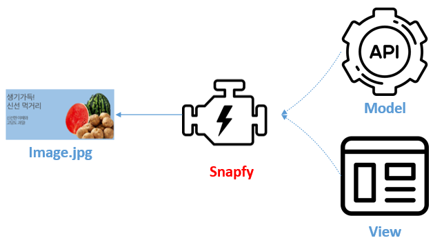
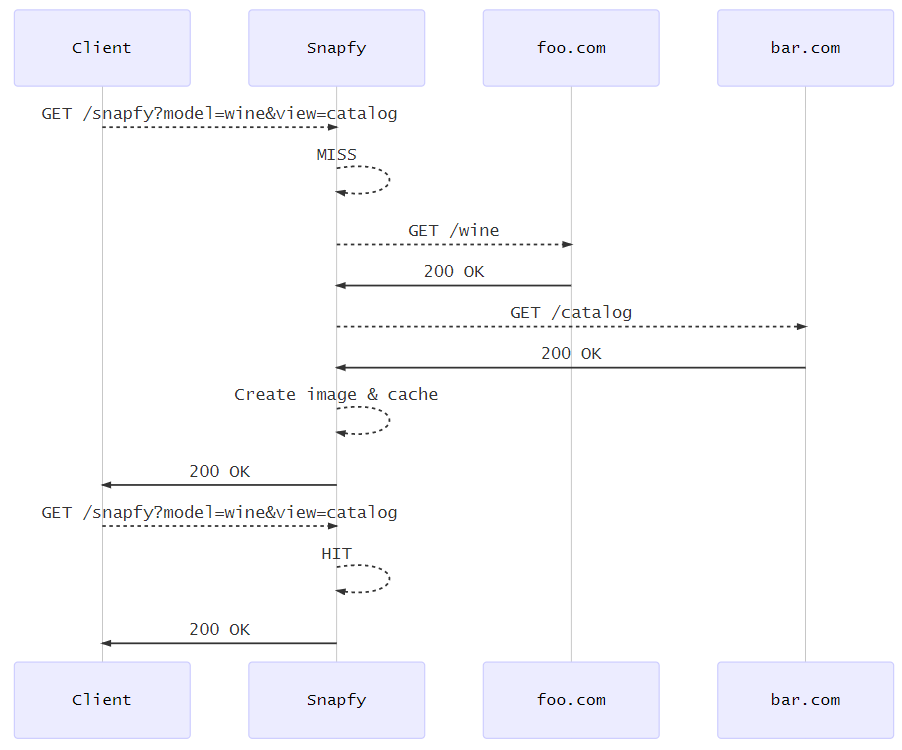

.. _snapfy_beta:

Snapfy ``Beta``
******************

스냅파이(Snapfy)는 데이터(Model)와 표현(View)을 실시간으로 결합하는 이미지 렌더링 엔진이다. 

기존 이미지 생성 프로세스와의 차이점은 아래와 같다.

==================== ====================== =======================
\                    스냅파이               기존 프로세스
==================== ====================== =======================
**방식**             On the fly             Batch
**서비스 투입**      즉시                   Batch 프로세스 종료 후
**저장공간**         STON 캐싱엔진 (LRU)    Storage
**형태**             단독 솔루션            백엔드 시스템
**유연성**           API 기반의 높은 유연성 낮음
**데이터 변경 반영** 즉시                   전체 이미지 일괄 재생산
**성능**             높음                   낮음
**연동범위**         WWW                    기업 백엔드
**2차 이미지 가공**  STON 이미지툴          추가 프로세스 필요
==================== ====================== =======================

스냅파이는 표준 기술만으로 동작한다. 간단하고 빠르게 서비스 투입이
가능하다.

-  **Model** - JSON, HTML/DOM

-  **View** - HTML, CSS, JavaScript, Jinja2, Images

-  **Control** - HTTP/S API

.. _header-n53:

클라이언트
====================================

클라이언트는 스냅파이가 게시한 API(엔드포인트)를 호출한다.

.. _header-n55:

GET 방식
------------------------------------

결합할 정보(Model)와 표현(View)을 QueryString으로 입력한다.

.. code:: http

   GET /snapfy?model=wine&view=catalog

.. _header-n58:

POST 방식
------------------------------------

Body와 QueryString을 혼합하여 사용한다.

.. code:: http

   # GET과 동일
   POST /snapfy?model=wine&view=catalog

   { }

.. code:: http

   # Model과 View 업로드
   POST /snapfy

   {
   	"model" : { },
   	"view" : "<html>...</hmtl>"
   }

.. code:: http

   # View만 업로드   
   POST /snapfy?model=wine

   {
   	"view" : "<html>...</hmtl>"
   }

.. code:: http

   # Model만 업로드
   POST /snapfy?view=catalog

   {
   	"model" : { }
   }

.. note::
   QueryString과 Body의 키가 충돌할 경우 Body가 우선한다.

그 밖에 이미지 출력 형태를 POST로 재정의 가능하다.

.. code:: http

   POST /snapfy?view=catalog&mode=wine

   {
   	"output" : "width=320;height=480;format=png;"
   }

.. _header-n70:

Model
====================================

모델은 JSON 형식과 HTML/DOM을 지원한다.

.. code:: json

   {
       "firstName": "John", 
       "lastName": "Smith", 
       "age": 25, 
       "address": { 
           "streetAddress": "21 2nd Street", 
           "city": "New York", 
           "state": "NY", 
           "postalCode": "10021" 
       }, 
       "phoneNumber": [ 
           { "type": "home", "number": "212 555-1234" }, 
           { "type": "fax", "number": "646 555-4567" } 
       ] 
   }

보이는 바와 같이 위 데이터는 어떠한 시각적 요소도 담고 있지 않다. 모델은
VIEW에 의해 참조될 뿐이다.
`JINJA2 <https://jinja.palletsprojects.com/en/2.10.x/>`__ 형식을
사용한다.

::

   {{firstname}}
   {{address.state}}
   {{phoneNumber.0.number}}

.. _header-n76:

View
====================================

View는 HTML + CSS로 제작한다. 제작된 HTML의 결과는 브라우저를 통해 확인
가능하다.

.. code:: html

   <!DOCTYPE html>
   <html>
   <head>
   
   </head>
   <body>
   <H1>John Smith</H1>
   
New York

   </body>
   </html>

위 코드를 아래와 같이 Jinja2 변수형식으로 치환한다.

.. code:: html

   <!DOCTYPE html>
   <html>
   <head>
   <meta name="snapfy-output" content="width=400;height=300;format=png" />
   
   </head>
   <body>
   <H1>{{firstname}} {{lastName}}</H1>
   
{{address.city}}

   </body>
   </html>

Snapfy엔진은 View의 태그를 참조하여 이미지를 생성한다. png포맷과 jpg를
지원한다.

.. code:: html

   <meta name="snapfy-output" content="width=256;height=128;format=jpg;quality=85" />

..

이미지툴을 통한 2차 가공이 가능하기 때문에 포맷은 큰 의미를 가지지
않는다. 아래 2표현 모두 가능하다.

.. code:: http

   GET /snapfy/dims/format/webp?view=catalog&mode=wine
   GET /snapfy?view=catalog&mode=wine/dims/format/webp

.. _header-n87:

설정
====================================

.. code:: xml

   # vhosts.xml - <Vhosts><Vhost>

   <Snapfy Status="Active">
       <Endpoints>
           <Endpoint Post="ON" Get="ON" RefCache="ON">
               <Control ViewParam="view" ModelParam="model">/snapfy</Control>
               <Model>https://foo.com/#model</Model>
               <View>https://bar.com/#view</View>
           </Endpoint>
       </Endpoints>
       <Output>
           <Width>640</Width>
           <Height>480</Height>
           <Format>png</Format>
           <Quality>100</Quality>
       </Output>
     </Snapfy>

``<Snapfy>`` 태그의 ``Status`` 속성이 ``Active``\ 일 때 활성화된다.

-  ``<Endpoints>`` 하위에 멀티 ``<Endpoint>``\ 를 통해 스냅파이로 노출할
   URL을 설정한다.

-  ``<Endpoint>`` 단위 엔드포인트를 설정한다.

   -  ``<Endpoint>`` 속성

      -  ``Post (기본: ON)`` Post 메소드 허용 여부

      -  ``Get (기본: ON)`` Get 메소드 허용 여부

      -  ``RefCache (기본: ON)`` View에서 참조하는 리소스(CSS,
         JavaScript, Images)가 STON에서 서비스 중이라면 STON으로부터
         다운로드 받는다. ``OFF`` 라면 원격에서 다운로드 받는다.

   -  ``<Control>`` 스냅파이로 서비스할 URL을 설정한다. ``ViewParam`` ,
      ``ModelParam`` 속성을 통해 HTTP QueryString 키 값을 설정한다.

   -  ``<Model>`` 모델 API 주소를 설정한다. ``ModelParam`` 의 값이
      ``#model`` 키워드로 치환된다.

   -  ``<View>`` View가 게시된 URL을 설정한다. ``ViewParam`` 의 값이
      ``#model`` 키워드로 치환된다.

-  ``<Output>`` 생성 이미지 형식을 설정한다.

   -  ``<Width> (기본: 640, 단위: pixel)`` 이미지 가로 크기

   -  ``<Height> (기본: 480, 단위: pixel)`` 이미지 세로 크기

   -  ``<Format> (기본: png)`` 이미지 포맷 (``png`` 또는 ``jpeg``)

   -  ``<Quality> (기본: 100, 단위: %)`` 포맷이 ``jpeg``\ 일 경우 이미지
      품질 (1~100)

   -  스냅파이는 다음 우선순위로 이미지 형식을 결정한다.

      1. Post body 데이터의 "output"

      2. View의 ``<meta name="snapfy-output">`` 의 ``content`` 속성

      3. ``<Output>`` 설정

위 설정은 다음과 같이 동작한다.

``<Endpoint RefCache="ON">`` 이라면 foo.com과 bar.com에서 참조된 모든
리소스는 캐싱 엔진 내에 적재되어 네트워크 지연으로 인한 서비스 속도
저하를 방지할 수 있다.

.. _header-n136:

운영
====================================

Model이나 View가 변경되면 TTL(Time To Live) 이후 자동반영된다. 즉시
변경을 원할 경우 아래와 같이 Purge API 호출로 즉시 반영이 가능하다.

.. code:: http

   # wine (model) 변경
   http://127.0.0.1:10040/command/purge?url=example.com/snapfy?model=wine&view=*

   # catalog (view) 변경
   http://127.0.0.1:10040/command/purge?url=example.com/snapfy?model=*&view=catalog
