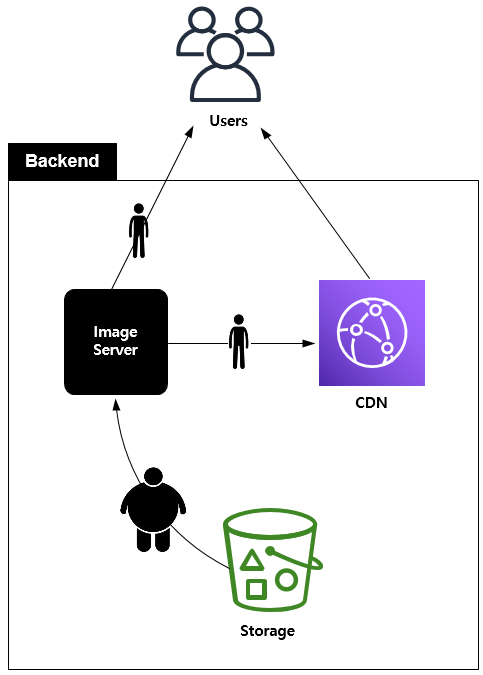
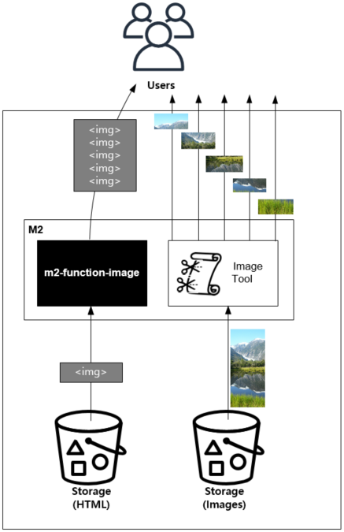

.. _pattern-image:

이미지 서비스 패턴
******************

이미지 개수가 억 단위가 되면 통제가 어렵다. 
배치는 답이 아니다. (단점 열거)
일관된 다이어그램을 위해 AWS Icon을 사용한다.


제목
====================================

가나다라


해결하고 싶은 문제
------------------------------------

마바사


패턴 설명
------------------------------------

아자차카


구현
------------------------------------

타파하


장점
------------------------------------

abcd


주의점
------------------------------------

efgh


기타
------------------------------------

hijk


이미지 용량절감
====================================

해결하고 싶은 문제
------------------------------------
고용량 이미지 파일이 서비스되는 경우 전송비용이 상승할 뿐만 아니라 클라이언트 서비스 품질이 저하되는 문제가 발생한다.


솔루션/패턴 설명
------------------------------------
이미지가 스토리지에 저장되면 통제가 불가능하다고 생각하는 경향이 있다. 
스토리지에 저장되기 전에 이미지 최적화 프로세스를 진행하려는 시도는 실패할 확률이 높다. 
서비스 고도화에 따라 스토리지로 향하는 입구가 많아지기 때문이다.

입구를 모두 통제할 수 없다면 단일 출구 정책을 사용하는 것이 효과적이다.



이미지서버가 이미지를 전송/배포하기 전 고용량 이미지를 최적화한다.


구현
------------------------------------
-  이미지 스토리지 앞에 이미지 변환서버 용도의 ``STON`` 을 배치한다.
-  ``STON`` 이미지툴 기능을 활성화한다. (최대크기를 제한하지 않는다.) ::
   
      # server.xml - <Server><VHostDefault><Options>
      # vhosts.xml - <Vhosts><Vhost><Options>

      <Dims Status="Active" Keyword="dims" MaxSourceSize="0" />


-  ``STON`` 이미지 포맷을 대상으로 URL 전처리 규칙을 추가한다. ::

      <URLRewrite>
         <Pattern>example.com/.*\.(jpg|png).*)</Pattern>
         <Replace>example.com/#1/dims/optimize</Replace>
      </URLRewrite>

-  이미지 스토리지 도메인을 ``STON`` 으로 위임한다. 


장점/효과
------------------------------------
-  기존 URL을 변경없이 사용한다.
-  항상 균일하게 최적화된 이미지 서비스가 가능하다.
-  별도의 관리/배치 프로세스 없이 이미지 처리가 자동화된다.
-  이미지 최적화 정책이 변경되더라도 무중단 정책 변경이 가능하다.
-  이미지 처리량이 많아질 경우 손쉽게 Scale-out이 가능하다.


주의점
------------------------------------

이미지 저장시 최소한의 용량 최적화는 반드시 필요하다.

-  이미지 크기가 너무 크면 자칫 스토리지 대역폭에 병목이 발생할 수 있다.
-  이미지 최적화를 위한 컴퓨팅 파워가 과도하게 투입될 수 있다.


기타
------------------------------------
-  자주 변환되는 이미지를 캐싱해 놓으면 불필요한 중복 최적화를 방지할 수 있다.


최대 이미지 해상도
====================================

해결하고 싶은 문제
------------------------------------
지나치게 큰 이미지는 웹페이지 레이아웃을 파괴한다. 
어떠한 이미지라도 가로 1200px을 넘지 않도록 제한하고 싶다.


솔루션/패턴 설명
------------------------------------
이미지서버가 이미지를 전송/배포하기 전 해상도를 검사한다.

.. figure:: img/dgm002.png
   :align: center

설정된 크기보다 큰 해상도라면 이미지를 축소한다.


구현
------------------------------------
-  이미지 스토리지 앞에 이미지 변환서버 용도의 ``STON`` 을 배치한다.
-  ``STON`` 이미지툴 `원본이미지 조건판단 <https://ston.readthedocs.io/ko/latest/admin/image.html#media-dims-byoriginal>`_ 을 설정한다. (최대 가로 1200px) ::
   
      # server.xml - <Server><VHostDefault><Options>
      # vhosts.xml - <Vhosts><Vhost><Options>

      <Dims Status="Active" Keyword="dims">
         <ByOriginal Name="limit-1200">
            <Condition Width="1200">/optimize</Condition>
            <Condition>/resize/1024x768/optimize</Condition>
         </ByOriginal>
      </Dims>


-  ``STON`` 다음과 같이 URL을 노출한다. ::

       http://image.example.com/koala.jpg/dims/byoriginal/limit-1200


장점/효과
------------------------------------
-  별도의 관리/배치 프로세스 없이 이미지 처리가 자동화된다.
-  최대 해상도 정책이 변경되더라도 실시간으로 적용할 수 있다.


주의점
------------------------------------
```` 처럼 태그에 고정된 값을 설정했다면 이미지 크기가 강제로 설정된다.


기타
------------------------------------
이미지 URL을 변경하고 싶지 않다면 `URL 전처리 <https://ston.readthedocs.io/ko/latest/admin/adv_vhost.html#url>`_ 를 사용한다.


키다리 이미지 분할 패턴
====================================

해결하고 싶은 문제
------------------------------------
상품기술서 이미지처럼 세로가 긴 이미지는 로딩 속도가 느리다.
특히 모바일 환경처럼 가시(visible)영역이 작은 경우 다운로드가 완료되기 전까지 사용자는 상품정보를 볼 수 없다.


솔루션/패턴 설명
------------------------------------
상품기술서는 독립된 HTML 조각(Snippet)으로 웹페이지에 삽입되는 경우가 일반적이다.
`m2-function-image <https://m2-kr.readthedocs.io/ko/latest/guide/view.html#m2-function-image>`_ 를 이용하면 이미지를 분할/병렬 로딩시켜 빠르게 상품기술서를 노출시킬 수 있다.



상품기술서 처리와 이미지 분할은 독립적으로 운영된다.


구현
------------------------------------
-  ``M2`` 를 HTML/이미지 스토리지 앞에 배치한다. (=HTTP 통신이 가능하다.)
-  ``M2`` 상품기술서를 처리할 엔드포인트를 생성한다. ::
   
      # vhosts.xml - <Vhosts><Vhost><M2><Endpoints><Endpoint>

      <Model>
         <Source>https://foo.com/#model</Source>
      </Model>
      <View>
         <Source>https://bar.com/#view</Source>
      </View>
      <Control>
         <Path>/productDetail</Path>
      </Control>


-  ``M2`` View파일에 ``m2-function-image`` 를 적용한다. (세로 500px을 기준으로 분할한다.) ::
   
      <html>
         <head>
            <meta name="m2-function-image" 
                  host="https://www.example.com/m2/image"
                  split-height="500">

         ... (생략)...
      </html>


-  ``M2/STON`` 이미지처리용 가상호스트를 생성하고 이미지툴 기능을 활성화한다. ::
   
      # vhosts.xml - <Vhosts>

      <Vhost Name="image.example.com">
         <Options>
            <Dims Status="Active" Keyword="dims" MaxSourceSize="0" />
         </Options>
      </Vhost>


-  ``M2/STON`` 이미지처리 경로 ``/m2/image/`` 가 ``image.example.com`` 을 찾아갈 수 있도록 `URL 전처리 <https://ston.readthedocs.io/ko/latest/admin/adv_vhost.html#url>`_ 를 구성한다. ::
   
      # vhosts.xml

      <Vhosts>
         ... (생략) ...

         <URLRewrite AccessLog="Replace">
            <Pattern><![CDATA[^www.example.com/m2/([^/]+)/(.*)]]></Pattern>
            <Replace><![CDATA[#1.example.com/#2]]></Replace>
         </URLRewrite>
      </Vhosts>


-  상품기술서 URL을 ``M2`` URL로 변경한다. 


장점/효과
------------------------------------
-  상품기술서 URL 변경만으로 간단히 도입이 가능하다.
-  최신(Modern) 브라우저의 병렬로딩 메커니즘을 통해 이전보다 훨씬 빠른 체감속도 개선효과를 얻을 수 있다. 


주의점
------------------------------------
너무 짧은 TTL(Time To Live)를 설정할 경우 실시간 처리비용이 높아진다. 
상품기술서는 자주 변경되지 않으니 최소 1일 이상의 TTL을 권장한다.


기타
------------------------------------
처리량이 늘어나면 `2-Tier 구조 <https://ston.readthedocs.io/ko/latest/admin/enterprise.html>`_ 도입을 고려한다.


워터마크 자동화 패턴
====================================