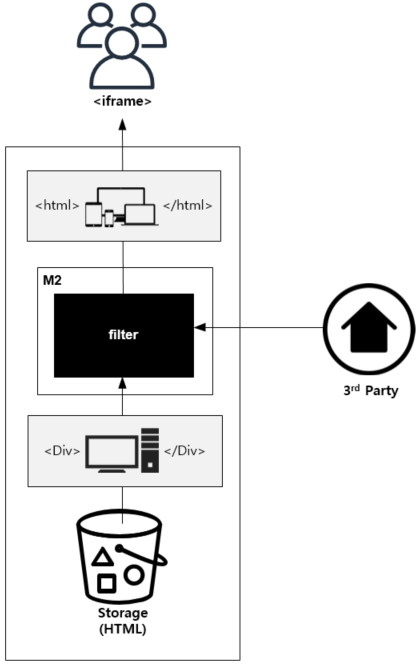
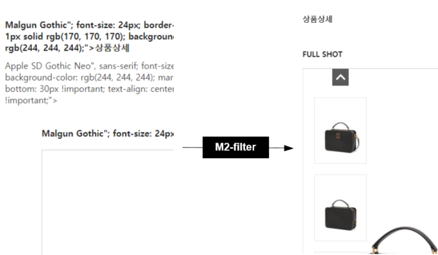
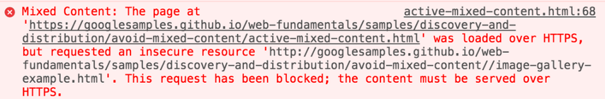
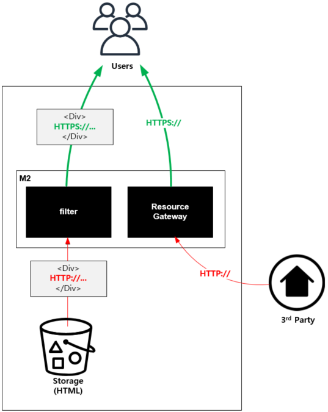

.. _pattern-webpage:

웹페이지 서비스 패턴
******************

웹페이지 구성시 도움이 되는 패턴들 모음.

반응형 상품기술서
====================================

해결하고 싶은 문제
------------------------------------
오픈마켓에서는 판매자가 상품기술서를 ``<HTML>`` 로 업로드한다.
반응형(Responsive)을 고려하지 않고 작성된 ``<HTML>`` 은 레이아웃과 사용자 경험을 망친다.
배치작업을 통한 마이그레이션에는 치명적인 문제가 있다.

-  기획이 변경되면 다시 마이그레이션해야 한다.
-  외부에서 참조되는 리소스는 통제가 불가능하다.

솔루션/패턴 설명
------------------------------------
전송시점에 상품기술서 ``<HTML>`` 를 반응형(Responsive)으로 수정한다.

부모 페이지와의 ``CSS`` / ``JavaScript`` 등과 충돌되지 않도록 ``<iframe>`` 으로 삽입한다.

구현
------------------------------------
-  상품기술서 스토리지 앞이나 외부 기술서 참조가 가능한 지점에 ``M2`` 를 배치한다. (=HTTP 통신이 가능하다.)
-  ``M2`` 상품기술서를 서비스할 ``www.example.com`` 에 생성한다. ::
   
      # vhosts.xml - <Vhosts><Vhost><M2><Endpoints><Endpoint>

      <Model>
         <Source>https://foo.com/#model</Source>
      </Model>
      <View>
         <Source>https://bar.com/#view</Source>
      </View>
      <Control>
         <Path>/item-detail</Path>
      </Control>

-  ``M2`` View파일에 상품기술서에 적용할 ``CSS`` 와 필터를 적용한다. 
-  프론트엔드에서 반응형 상품기술서를 AJAX로 삽입한다. ::

      https://www.exmaple.com/item-detail?model=ITEM001&view=responsive

장점/효과
------------------------------------
-  상품기술서를 일일이 수정하지 않고 페이지 레이아웃/UX를 개선할 수 있다.
-  프론트엔드 스타일 충돌없이 도입이 가능하다.
-  지속적으로 상품기술서 정책을 보강할 수 있다.

주의점
------------------------------------
기존 상품기술서를 삽입하는 방식과 스타일 충돌여부를 미리 살펴야 한다.

기타
------------------------------------
마이그레이션 과정 중 깨진 상품기술서에 대한 보정도 가능하다.

혼합 콘텐츠 (Mixed Contents)
====================================

해결하고 싶은 문제
------------------------------------
``HTTPS`` 웹페이지에서 (외부에서 제공되는) ``HTTP`` 리소스를 참조할 경우 콘텐츠가 차단된다.

-  `혼합 콘텐츠란? - Google <https://developers.google.com/web/fundamentals/security/prevent-mixed-content/what-is-mixed-content?hl=ko>`_
-  `What is mixed content? - Clourflare <https://www.cloudflare.com/learning/ssl/what-is-mixed-content/>`_

솔루션/패턴 설명
------------------------------------
``<HTML>`` 내에 존재하는 혼합 콘텐츠 문제를 클라이언트에게 전송하기 전 필터링한다. 

외부 리소스는 ``M2`` 를 통해 단일 ``HTTPS`` 도메인으로 제공된다. 
3rd Party에 의해 혼합 콘텐츠가 포함된 ``<iframe>`` 이 제공되더라도 일관되게 필터링된다.

구현
------------------------------------
-  스토리지 앞에 ``M2`` 를 배치한다. (=HTTP 통신이 가능하다.)
-  ``M2`` 혼합 콘텐츠를 필터링할 엔드포인트를 ``www.example.com`` 에 생성한다. ::
   
      # vhosts.xml - <Vhosts><Vhost><M2><Endpoints><Endpoint>

      <Model>
         <Source>https://foo.com/#model</Source>
      </Model>
      <View>
         <Source>https://bar.com/#view</Source>
      </View>
      <Control>
         <Path>/item-detail</Path>
      </Control>

-  ``M2`` View파일에 nunjucks 필터를 적용한다. ::
   
      {{ model.__raw | toHttps('/item-detail/mixed') }}

-  ``M2/STON`` 혼합 콘텐츠 게이트웨이용 가상호스트를 생성하고 ``ByClient`` 기능을 활성화한다. ::
   
      # vhosts.xml - <Vhosts>

       <Vhost Name="mixed.example.com">
          <Origin ByClient="ON" ByClientKeyword="byclient" Protocol="HTTP"/>
       </Vhost>

-  ``M2/STON`` 혼합 콘텐츠 리소스는 ``www.example.com/item-detail/mixed/..`` 로 제공된다.
   해당 URL이 ``mixed.example.com`` 에서 처리될 수 있도록 URL 전처리를 규칙을 추가한다. ::

      <URLRewrite AccessLog="Replace">
         <Pattern><![CDATA[www.example.com/item-detail/mixed/(.*)]]></Pattern>
         <Replace><![CDATA[mixed.example/byclient/#1]]></Replace>
      </URLRewrite>

-  혼합 콘텐츠가 포함된 URL을 ``M2`` URL로 변경한다. ::

      https://www.exmaple.com/item-detail?model=ITEM001&view=...

장점/효과
------------------------------------
-  마이그레이션 없이 즉시 웹 사이트에 ``HTTPS`` 를 적용한다.
-  통제할 수 없는 외부 리소스에도 일관되게 ``HTTPS`` 를 적용한다.
-  추후 보안수준이 강화되더라도 ``M2`` 를 통해 정책개선이 가능하다.

주의점
------------------------------------
현재(2020.06) 이미지등 단순 참조 리소스는 차단되지 않기 때문에 해당 콘텐츠는 배제하는 것이 효율적이다.
추후 보안검사 수준이 상향되는 경우 이미지에 대해서도 이 패턴의 사용이 가능하다. 
이 경우 발생하게되는 데이터 트래픽 처리비용에 대해 고려해야 한다.

기타
------------------------------------
SSL/TLS Offloading을 제공하는 CDN이 있다면 같이 활용할 수 있다.

